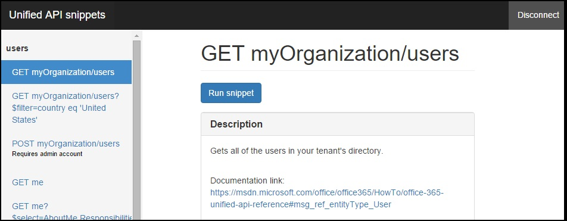

# Microsoft Graph API snippets with Angular

The Microsoft Graph API (formally known as "unified API (preview)") exposes multiple APIs from Microsoft cloud services through a single REST API endpoint. This repository shows you how to access multiple resources, including Microsoft Azure Active Directory (AD) and the Office 365 APIs, by making HTTP requests to the Microsoft Graph API in an Angular application. 



**Note: If possible, please use this sample with a "non-work" or test account in Office 365. With the current version of the project, it does not clean up the created objects in your mailbox, calendar, contacts, and objects created from additional operations. At this time you'll have to manually remove these artifacts, for example, sample mails, contacts, and calendar events.**  

## Prerequisites

* [Node.js](https://nodejs.org/). Node is required to run the sample on a development server and to install dependencies. 
* An Office 365 account. You can sign up for [an Office 365 Developer subscription](https://portal.office.com/Signup/Signup.aspx?OfferId=6881A1CB-F4EB-4db3-9F18-388898DAF510&DL=DEVELOPERPACK&ali=1#0) that includes the resources that you need to start building Office 365 apps.

     > Note: If you already have a subscription, the previous link sends you to a page with the message *Sorry, you can’t add that to your current account*. In that case use an account from your current Office 365 subscription.
* A Microsoft Azure tenant to register your application. Azure Active Directory (AD) provides identity services that applications use for authentication and authorization. A trial subscription can be acquired here: [Microsoft Azure](https://account.windowsazure.com/SignUp).

     > Important: You also need to make sure your Azure subscription is bound to your Office 365 tenant. To do this, see the Active Directory team's blog post, [Creating and Managing Multiple Windows Azure Active Directories](http://blogs.technet.com/b/ad/archive/2013/11/08/creating-and-managing-multiple-windows-azure-active-directories.aspx). The section **Adding a new directory** will explain how to do this. You can also see [Set up your Office 365 development environment](https://msdn.microsoft.com/office/office365/howto/setup-development-environment#bk_CreateAzureSubscription) and the section **Associate your Office 365 account with Azure AD to create and manage apps** for more information.
* A client ID and redirect URI values of an application registered in Azure. This sample must be registered and granted specific permissions for **Microsoft Graph API**. [Add a web application in Azure](https://msdn.microsoft.com/office/office365/HowTo/add-common-consent-manually#bk_RegisterWebApp) and [grant the proper permissions](https://github.com/OfficeDev/O365-Angular-Microsoft-Graph-Snippets/wiki/Grant-permissions-to-the-Snippets-application-in-Azure) to it.

     > Note: During the app registration process, make sure to specify **http://127.0.0.1:8080/** as the **Sign-on URL**.

## Configure and run the app

1. Using your favorite IDE, open **config.js** in *public/scripts*.
2. Replace *{your_app_client_ID}* with the client ID of your registered Azure application.
3. Install project dependencies with Node's package manager (npm) by running ```npm install``` in the project's root directory on the command line.
4. Start the development server by running ```node server.js``` in the project's root directory.
5. Navigate to ```http://127.0.0.1:8080/``` in your web browser.

To learn more about the sample, visit our [understanding the code](https://github.com/OfficeDev/O365-Angular-Microsoft-Graph-Snippets/wiki/Understanding-the-Snippets-sample-code) Wiki page.

## Questions and comments

We'd love to get your feedback about the Microsoft Graph API snippets with Angular sample. You can send your questions and suggestions to us in the [Issues](https://github.com/OfficeDev/O365-Angular-Microsoft-Graph-Snippets/issues) section of this repository.

Questions about Office 365 development in general should be posted to [Stack Overflow](http://stackoverflow.com/questions/tagged/Office365+MicrosoftGraph). Make sure that your questions or comments are tagged with [Office365] and [MicrosoftGraph].
  
## Additional resources

* [Office Dev Center](http://dev.office.com/)
* [Microsoft Graph API](http://graph.microsoft.io)
* [Office 365 Angular Connect sample using Microsoft Graph API](https://github.com/OfficeDev/O365-Angular-Microsoft-Graph-Connect)

## Copyright
Copyright (c) 2015 Microsoft. All rights reserved.
